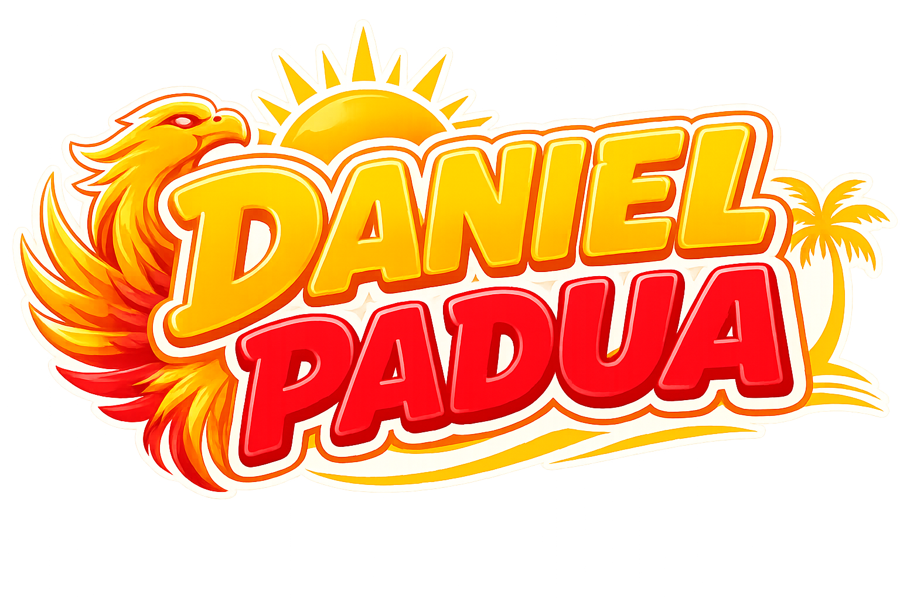

# Padua Portfolio - IT Company Documentation



## 📖 Overview

The **Padua Portfolio** is a premium, high-performance web application designed for Team Padua Client Servicing. It serves as both a professional showcase of achievements and a functional portal for Sun Life Financial Advisors to request custom Client Policy Cards. 

Built with modern web technologies, the platform prioritizes **aesthetic excellence, smooth micro-interactions, and 3D rendering capabilities**, ensuring a world-class user experience.

---

## 🏗 Architecture & Folder Structure

This project follows a strict, modular architecture designed for scalability and maintainability, adhering to modern Next.js App Router conventions.

```text
padua-portfolio/
├── app/                  # Next.js App Router root (Pages, Layouts, global CSS)
├── components/           # Reusable UI components (Buttons, Inputs, 3D Canvas, Forms)
├── sections/             # Large page sections (Hero, About, Achievements, Portfolio)
├── lib/                  # Utility functions and shared constants
├── hooks/                # Custom React hooks
├── public/               # Static assets (Images, Videos, Fonts)
├── types/                # TypeScript type definitions
└── ...config files       # Tailwind, PostCSS, ESLint, TypeScript configs
```

### Key Architectural Decisions:
- **Separation of Concerns:** Complex pages are broken down into logical `sections/` (e.g., `Achievements.tsx`, `CPCRequest.tsx`), which are then assembled in `app/page.tsx`.
- **Component Reusability:** Micro-components (like `Container.tsx` or `FloatingField.tsx`) are isolated in the `components/` directory to ensure consistent styling across the application.
- **Client vs. Server Components:** By default, Next.js uses Server Components for performance. Highly interactive components (like Framer Motion animations and Three.js canvases) are explicitly marked with `"use client"`.

---

## 💻 Tech Stack

| Category | Technology |
| :--- | :--- |
| **Framework** | [Next.js (App Router)](https://nextjs.org/) |
| **Library** | [React](https://reactjs.org/) |
| **Styling** | [Tailwind CSS](https://tailwindcss.com/) |
| **Animation** | [Framer Motion](https://www.framer.com/motion/) |
| **3D Rendering** | [React Three Fiber](https://docs.pmnd.rs/react-three-fiber/) & Drei |
| **Form Handling** | [React Hook Form](https://react-hook-form.com/) |
| **Language** | [TypeScript](https://www.typescriptlang.org/) |

---

## ✨ Core Features

- **Interactive 3D Client Policy Card Stage (`CPCStage.tsx`)**
  - Uses WebGL and Three.js to render a fully interactive, rotatable 3D model of the requested policy card.
  - Supports dynamic theme switching (Original, Classic White, Executive Black).
- **Premium Loading Sequence (`LoadingScreen.tsx`)**
  - A sophisticated sequence utilizing Framer Motion to ensure assets are loaded while providing an Apple-like cinematic intro.
- **Dynamic Galleries (`Achievements.tsx` & `Portfolio.tsx`)**
  - Highly responsive masonry and grid layouts.
  - Features ambient cursor-following glow effects and fullscreen immersive media modals.
- **Client Policy Card Request Portal (`RequestForm.tsx`)**
  - A robust, multi-step form architecture with client-side validation and file upload capabilities.

---

## 🚀 Getting Started

### Prerequisites
- Node.js (v18.17 or later)
- npm, yarn, pnpm, or bun

### Installation

1. **Clone the repository** (if applicable) or navigate to the project directory:
   ```bash
   cd padua-portfolio
   ```

2. **Install dependencies:**
   ```bash
   npm install
   ```

3. **Run the development server:**
   ```bash
   npm run dev
   ```

4. **Access the application:**
   Open [http://localhost:3000](http://localhost:3000) in your browser.

---

## 🛠 Development Guidelines

- **Styling:** Use Tailwind utility classes. For complex gradients or brand-specific colors (e.g., Gold), utilize CSS variables defined in `globals.css` (e.g., `var(--color-gold)`).
- **Animations:** Do not use heavy JS intervals. Rely exclusively on `framer-motion` for complex sequences or Tailwind's `transition` utilities for simple hover states.
- **3D Assets:** All Three.js logic should be self-contained within `components/CPCStage.tsx` and its child components to prevent polluting standard React UI logic.

---

*Documentation auto-generated and maintained by the engineering team.*
